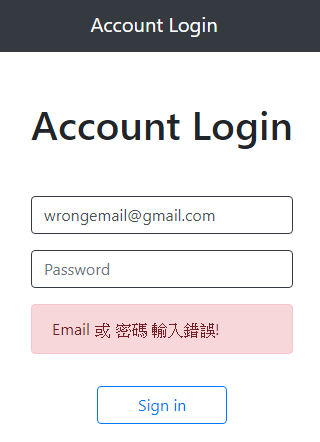

# 帳號密碼cookie試作
帳號密碼cookie試作

# 功能描述
- 輸入正確的Email及密碼可顯示歡迎頁面
- 記錄使用者姓名於cookie中
- 輸入錯誤的Email及密碼會顯示輸入錯誤!

# 測試資料
| name    |        email        |         password |
| :------ | :-----------------: | ---------------: |
| Tony    |   tony@stark.com    |       iamironman |
| Steve   | captain@hotmail.com | icandothisallday |
| Peter   |  peter@parker.com   |         enajyram |
| Natasha |  natasha@gamil.com  |       *parol#@$! |
| Nick    |   nick@shield.com   |         password |
| AaAa    |    aaaa@aaaa.com    |             aaaa |

# 預覽圖片

# 環境建置與需求
- Node.js: v10.15.0
- Express: v4.17.1
- Express-Handlebars: v5.1.0
- body-parser: v1.19.0
- express-session: v1.17.1

# 安裝與執行步驟
1. 下載專案
> git clone https://github.com/ShengYaoHuang/login_session_test.git

2. 進入專案資料夾
> cd account_login

3. 下載套件
> npm install

4. 執行程式
> npm run dev
